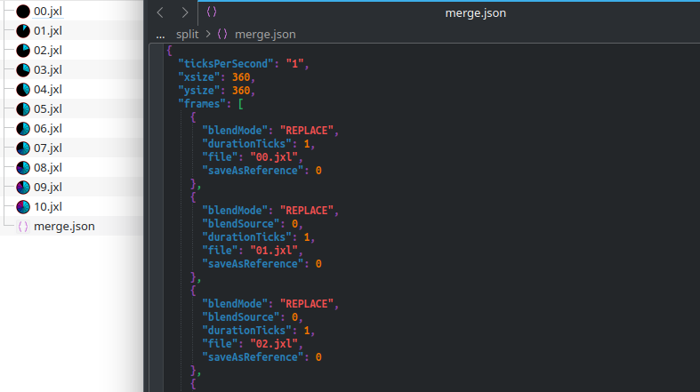
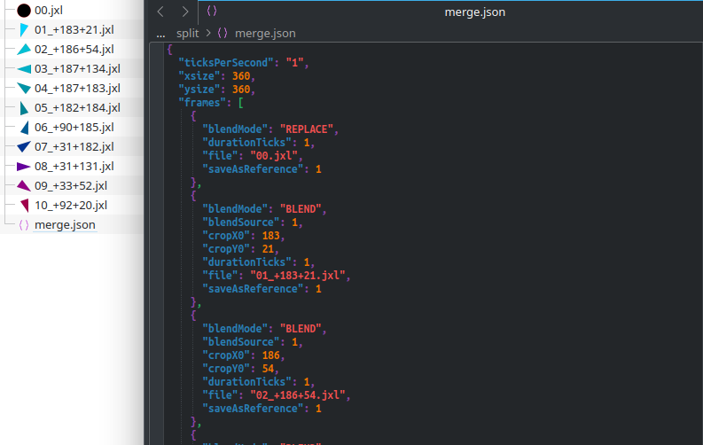
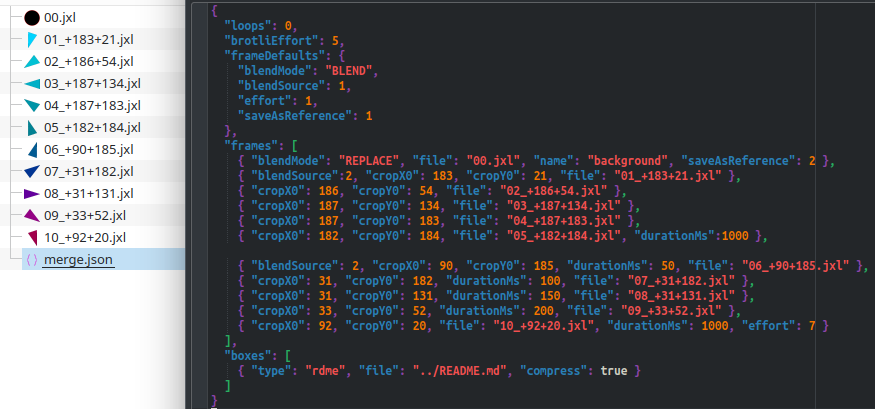
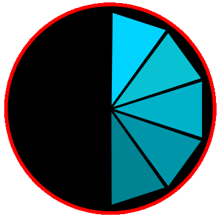

# JXLTK - A JPEG XL Toolkit
This is a utility for splitting and merging multi-frame JXL files.

It can:

- Merge several JXL files into one multi-layer/multi-frame JXL.
- Split a JXL file into its individual frames and metadata boxes.
- Add arbitrary metadata boxes.
- Extract ICC profiles from JXL files.

Effectively this just exposes some of [libjxl](https://github.com/libjxl/libjxl)'s
animation features that you can't get at via `cjxl`.

## Limitations
- All inputs and outputs are JXL. It won't read or write PNGs, JPEGs, TIFFs, etc.  Convert
  your inputs with `cjxl -d 0 -e 1` if necessary.
- It's strictly limited to the capabilities of the libjxl API, meaning almost every
  operation involves re-encoding pixels. For this reason, it defaults to lossless
  compression. Even so, any special effects (noise, splines, spots, ...) in the input will
  get rasterised in the output.
- Support for extra channels (other than the main alpha channel) is limited.
  Splitting preserves them, but the details of how they're meant to be blended
  are not captured, and merging currently ignores them totally.
- This is mainly tailored to what I like to to with JXL files, so it might not support
  all your favorite cjxl options.

## Build
### Dependencies
jxltk depends on:

- [libjxl](https://github.com/libjxl/libjxl) (libjxl, libjxl_threads)
- googletest (for unit tests only)

and requires `cmake` to build.

### Building on Linux

On a Debian-like system, the following commands should work.  Other Unixes will be
similar.

```bash
sudo apt install build-essential cmake libjxl-dev libgtest-dev
git clone https://github.com/alistair7/jxltk
mkdir jxltk-build
cd jxltk-build
cmake -DCMAKE_BUILD_TYPE=Release ../jxltk
cmake --build .

# Optionally, install the utility to /usr/local/bin
sudo cmake --install .
```

### Building on Windows
Left as an excercise :)

It should work fine, but I haven't tried it yet.  I'll update this section when I have.

My suggestion would be:

- Install libjxl via [vcpkg](https://learn.microsoft.com/en-us/vcpkg/).
- Run cmake on jxltk with
  `-DCMAKE_TOOLCHAIN_FILE=<vcpkg-root>/scripts/buildsystems/vcpkg.cmake`

See https://learn.microsoft.com/en-us/vcpkg/users/buildsystems/cmake-integration

Good luck!

## Command Line ##
All commands broadly look like this:

```
        jxltk MODE [options] [filenames]
```

Where MODE is one of the following: `split`, `merge`, `icc`, `gen`.

In most places, a filename of '-' means stdin or stdout.  The MODE must come before any
other option (the only exception being -h/--help).

### Global Options
These can be used in any command.

```
  -h, --help
        Display the help text and exit.

  -v, --verbose
        More detailed console output - use twice for debug, thrice for trace.

  -q, --quiet
        Less console output - use twice to see only errors, thrice for silence.

  --threads=N
        Maximum number of threads to use for encoding/decoding.
        Default is '0', meaning choose automatically.
```

### Split, Merge, and Gen Options
These options are common to the `split`, `merge`, and `gen` modes.

```
  -d FLOAT, --distance=FLOAT
        Butteraugli distance for encoded files. Default is 0 (lossless).

  -e 1-10, --effort=1-10
        Encoding effort.  Default is whatever libjxl decides.

  --best
        Equivalent to `--effort=10 --compress-boxes=1 --brotli-effort=11`.

  -E INT, --modular-nb-prev-channels=INT
        Number of previous channels modular mode is allowed to reference.

  -I 0-100, --iterations=0-100
        Percentage of pixels used to learn MA trees in modular mode. Default is whatever libjxl decides.

  --patches=0/1
        Enable (1) or disable (0) automatic patch generation for all frames. Default is whatever libjxl decides.
```

### `split` Mode
Split a single JXL into individual frames and boxes, and write each to a separate file in
a named output directory.  This also writes a file called "merge.json", which contains
metadata about the frames.  This can be passed to `merge` mode to rebuild the
original(-ish) multi-frame JXL.

```
        jxltk split [opts] [input.jxl] [outputdir]
```

Options for split mode:

^ See also the common [Split, Merge, and Gen Options](#split-merge-and-gen-options).

```
  -c, --coalesce
        Flatten layers and output only full-image-sized animation frames. The merge config
        file will always use blend mode `REPLACE`, and all x/y offsets will be 0.

  -C, --config-only
        Just generate the JSON merge config on stdout and don't write any files. You
        should not specify an output directory.

  --data-type=u8|u16|f32
        Force processing samples as uint8, uint16, or float type. This is mainly useful
        to force decoding to use floats, so it doesn't clamp samples that are outside the
        nominal [0,1] range.

  --ms
        Output frame durations in (possibly rounded) milliseconds instead of ticks in the
        merge config.

  --full
        Generate "full" merge config, with fewer implied defaults.

  -Y, --overwrite
        Overwrite existing files without asking.
```

Given the following animation...


...splitting with coalescing enabled:

```bash
jxltk split -ce1 input.jxl outputdir
```



...and with coalescing disabled...

```bash
jxltk split -e1 input.jxl outputdir
```



(The offsets in the filenames aren't significant - only `cropX0` and `cropY0` matter.)


### `merge` Mode
Take one or more JXL files as input, and produce a single JXL as output. Input files can
be specified on the command line, but it's better to create a "merge config" JSON file
that references the input files, as this gives you more control over durations, cropping,
and blending.

```
        jxltk merge [opts] [inputs...] [output.jxl]
```

It's possible to "merge" a single file if you just want to recompress it. In this case,
jxltk behaves somewhat like cjxl.

Some options can be specified both on the command line and in the merge config file:

- Options specified on the command line override everything else, and apply to all
  frames/boxes.
- Options associated with specific frames/boxes in the merge config are applied if not
  overridden by the command line options.
- Options in the `frameDefaults`/`boxDefaults` sections of the merge config are used
  if there is no overriding command-line or frame/box-specific option.

Simple use (no merge config):

```
# Animation with fixed frame rate of 10fps, where each frame just replaces the last
jxltk merge --durationMs=100 -e7 frame*.jxl output.JXL

# Compose a layered sill image using normal alpha blending
jxltk merge --blend-mode=BLEND background.jxl foreground.jxl text.jxl output.JXL`
```

Advanced use:

```
jxltk merge -M merge.json -d1 -e7 output.JXL
```

See [Merge Configuration Files](#merge-configuration-files) to find out what you can do in
merge.json.

Options for merge mode:

^ See also the common [Split, Merge, and Gen Options](#split-merge-and-gen-options).

```
  -M FILE, --merge-config=FILE
        Path to a JSON merge config file to read.

  --compress-boxes=0|1
        Globally disable (0) or enable (1) Brotli compression of metadata boxes.

  --brotli-effort=0-11
        Effort for Brotli compression of metadata.

  --duration-ms=INT
        Duration of each frame in milliseconds.

  --duration-ticks=INT
        Duration of each frame in ticks.

  -r N[/D], --ticks-per-second=N[/D]
        Number of animation ticks per second, given as an integer or rational.
        Default is 100 (10fps).

  --blend-mode=REPLACE/BLEND/ADD/MUL/MULADD
        Blend mode for all frames.  Default is REPLACE.

  --data-type=u8|u16|f32
        Force processing samples as uint8, uint16, or float type.

  -Y, --overwrite
        Overwrite existing files without asking.

  --color-from=FILE
        Assign the color profile from the named JXL or ICC file. Pixels are reinterpreted,
        not converted.

  --level=5|10
        Explicitly set the codestream conformance level.
```

### `icc` Mode
Just extracts the ICC profile from a JXL file.  This may be a "real" ICC, or a close
approximation to the image's CICP values (ITU-T-H.273).

```
        jxltk icc [input.jxl] [output.icc]
```

The output name can be omitted or "-" to write the ICC to stdout.


### `gen` Mode
Convenience mode for generating a template merge config file based on a set of files.

```
        jxltk gen [options] [inputs...]
```

This doesn't read any files - it just creates a merge config using the filenames as
frames.  If the filename happens to contain a string that looks like an x-y offset
(`[\+\-][0-9]+[\+\-][0-9]+`), the config will automatically populate the `cropX0` and
`cropY0` fields for that frame.

Most options for gen mode just add configuration lines to the generated JSON, often
within `frameDefaults`.

Options for gen mode:

^ See also the common [Split, Merge, and Gen Options](#split-merge-and-gen-options).

```
  --compress-boxes=0|1
        Globally disable (0) or enable (1) Brotli compression of metadata boxes.

  --brotli-effort=0-11
        Effort for Brotli compression of metadata.

  --duration-ms=INT
        Duration of each frame in milliseconds.

  --duration-ticks=INT
        Duration of each frame in ticks.

  -r N[/D], --ticks-per-second=N[/D]
        Number of animation ticks per second, given as an integer or rational.
        Default is 100 (10fps).

  --blend-mode=REPLACE/BLEND/ADD/MUL/MULADD
        Blend mode for all frames.  Default is REPLACE for the first frame, BLEND for the
        rest.

  --full
        Generate "full" merge config, with fewer implied defaults.

  --color-from=FILE
        Assign the color profile from the named JXL or ICC file.

  --level=5|10
        Explicitly set the codestream conformance level.
```


## Merge Configuration Files
A merge config file is a JSON document describing how to compose a JXL from one or
more frames and boxes.

Hint: a good way of seeing the available options is to run `jxltk gen --full *.jxl` on a
bunch of JXL files, or splitting an existing multi-frame JXL with `--full` - this will
give you a verbose merge config.

Here's a simple example that constructs a still multi-layer image:

```JSON
{
  "frameDefaults": {
    "blendMode": "BLEND"
  },
  "frames":
  [
    {
      "file": "background.jxl",
      "blendMode": "REPLACE"
    },
    {
      "file": "overlay1.jxl"
    },
    {
      "file": "overlay2.jxl",
      "cropX0": 100,
      "cropY0": 200,
      "name": "speech bubble"
    }
  ]
}
```

```bash
jxltk merge -v --merge-config=merge.json --effort=7 output.jxl
```

- All referenced files are expected to be single-frame JXLs, but if they're not, we'll
  just read the first coalesced frame. Paths are relative to the directory containing
  the merge config.

- The contents of `background.jxl` will become the first frame. Because we haven't set any
  dimensions (`xsize`, `ysize`) or color profile (`color`) for the output, both are
  inherted from `background.jxl`.

- The second frame is read from `overlay1.jxl`, and will be alpha blended with the
  background. Frame dimensions don't have to match. By default, each frame is placed at
  (0,0) on the "canvas". Unless you set a specific image size, the canvas stretches to fit
  all pixels of all frames (in positive x and y only - frames with negative offsets will
  always be at least partially cropped). `overlay1.jxl` *should* have the same color
  profile as the previous frame - if not, it gets reinterpreted.

- The final frame is alpha blended onto the previous two, at position (100,200) on the
  canvas. This frame also has a name, which will be stored in the output file.


Here's a more complicated merge config for an animation which also includes layers:

```JSON
{
  "loops": 3,
  "xsize": 800,
  "ysize": 600,
  "frameDefaults": {
    "blendMode": "BLEND",
    "durationMs": 4000
  },
  "frames":
  [
    {
      "copyBoxes": true,
      "name": "Name of the first frame",
      "file": "frame0.jxl",
      "blendMode": "REPLACE",
      "durationMs": 0,
    },
    {
      "file": "overlay.jxl",
      "cropX0": 100,
      "cropY0": 200,
      "durationMs": 4000,
      "saveAsReference": 1
    },
    {
      "blendSource": 1,
      "blendMode": "ADD",
      "file":"addedframe.jxl",
    }
  ],
  "boxes":
  [
    {"type":"Exif", "file":"pic.exif", "compress":true },
    {"type":"xml ", "file":"../pic.xmp", "compress":true },
    {"type":"what", "file":"/dev/null" }
  ]
}
```

- Frame durations can be given in milliseconds (`durationMs`) or ticks (`durationTicks`)
  (but not both in the same config). If you use ticks, you should also set the
  `ticksPerSecond`. If you use milliseconds, a suitable tick rate is calculated
  automatically.

- Arbitrary metadata boxes can be added to the output, with their contents read from
  existing files.

- Metadata boxes can also be copied from any/all of the input JXLs, by specifying
  `"copyBoxes": true` in the frame settings. This will copy all non-JXL-reserved boxes
  to the output.

### Merge Example

Re-merging the file from the `split` example, using different durations and blending
options:



```
$ jxltk merge -M merge.json -v -d0 -E3 broken_clock.jxl
Merging 11 images
Writing basic info: 360x360, 3+1 channels (8-bit color, 8-bit alpha), uses_original_profile=yes animated: infinite loops 20t/s
Writing box [1/1]: 'brob'/'rdme'
Writing frame [1/11]: 360x360 d0 e1 E3 blend={mode=REPLACE source=1 save=2} name=background file=00.jxl
Writing frame [2/11]: 90x152+183+21 d0 e1 E3 blend={mode=BLEND source=2 save=1} file='01_+183+21.jxl'
Writing frame [3/11]: 145x122+186+54 d0 e1 E3 blend={mode=BLEND source=1 save=1} file='02_+186+54.jxl'
Writing frame [4/11]: 146x92+187+134 d0 e1 E3 blend={mode=BLEND source=1 save=1} file='03_+187+134.jxl'
Writing frame [5/11]: 144x123+187+183 d0 e1 E3 blend={mode=BLEND source=1 save=1} file='04_+187+183.jxl'
Writing frame [6/11]: 89x153+182+184 d0 e1 E3 duration=1000ms blend={mode=BLEND source=1 save=1} file='05_+182+184.jxl'
Writing frame [7/11]: 90x152+90+185 d0 e1 E3 duration=50ms blend={mode=BLEND source=2 save=1} file='06_+90+185.jxl'
Writing frame [8/11]: 145x122+31+182 d0 e1 E3 duration=100ms blend={mode=BLEND source=1 save=1} file='07_+31+182.jxl'
Writing frame [9/11]: 145x93+31+131 d0 e1 E3 duration=150ms blend={mode=BLEND source=1 save=1} file='08_+31+131.jxl'
Writing frame [10/11]: 144x123+33+52 d0 e1 E3 duration=200ms blend={mode=BLEND source=1 save=1} file='09_+33+52.jxl'
Writing frame [11/11]: 89x153+92+20 d0 e7 E3 duration=1000ms blend={mode=BLEND source=1 save=1} file='10_+92+20.jxl'
Finished writing 'broken_clock.jxl'.
```



### Merge Config Reference

#### Keys at the top level
These keys are for setting properties of the whole image, and roughly correspond to
the "BasicInfo" and color profile in the libjxl API.


`boxes` / `boxDefaults`: See [`boxes` Array](#boxes-array). `boxDefaults` is an optional
fallback box configuration - the supported keys are exactly the same as for the objects in
the `boxes` array.  Keys that are not specified for individual boxes will default to the
values defined here, if any.

`brotliEffort`: Effort level for Brotli compression of all non-JXL metadata boxes.  0-11.

`codestreamLevel`: May be set to 5 or 10 to indicate the intended conformance level for
the resulting file.  It's up to the library whether it actually produces a `jxll` box
declaring the level - if you set it to 10, it always does.

`color`: See [`color` Object](#color-object).

`frames` / `frameDefaults`: See [`frames` Array](#frames-array). `frameDefaults` is an
optional fallback frame configuration - the supported keys are exactly the same as for the
objects in the `frames` array.  Keys that are not specified for individual frames will
default to the values defined here, if any.

`intrinsicXsize` / `intrinsicYsize`: Preferred display size of the image in pixels.

`loops`: Number of times to loop if this is an animation. 0 (the default) means infinite.

`orientation`: How the decoded image should be transformed before display. Options are:
`identity` (the default), `flip_horizontal`, `rotate_180`, `flip_vertical`, `transpose`,
`rotate_90_cw`, `anti_transpose`, `rotate_90_ccw`. The value is not case sensitive, and
is optionally prefixed with "JXL_ORIENT_".

`ticksPerSecond`: Used with `durationTicks`, specifies how many ticks elapse in 1 second.
This is expressed as a rational number given as a string: "a/b", or simply "a" to use
an implicit denominator of 1. Ignored if the image is not an animation or uses
milliseconds for frame timing.

`xsize` / `ysize`: The width and height, respectively, in pixels, of the resulting image.
Frames are allowed to be bigger or smaller than this, or offset such that they don't
entirely fit on the canvas.  If `xsize` and `ysize` are not specified, they are set
automatically such that all pixels with positive X and Y coordinates fit within the image
dimensions, taking into account the size and offset of all frames.  (It will not stretch
to fit pixels at negative offsets.)

#### `frames` Array
Each element of the `frames` array adds a frame to the resulting image.  The frame
dimensions are always implicit, based on the dimensions of each input file.  The following
keys can appear in each frame array element:

`blendMode`: How this frame is combined with the previous frames. Options are:
`replace` (or `JXL_BLEND_REPLACE`, or `REPLACE`, ...), `blend`, `add`, and `muladd`.
The default is `replace`.

`blendSource`: 0-3: the source frame to blend this frame with. Default is 0.

`copyBoxes`: (Boolean) If this is `true`, all non-JXL-reserved metadata boxes that exist
in this input file are copied to the merged file.  (If your inputs were created by
`jxltk split`, there will be no such boxes.)  Whether these boxes are written as
compressed brob types is controlled by `boxDefaults` (or the command line).

`cropX0`/`cropY0`: Offset from the left/top, respectively, of the canvas, where this
frame should be displayed.  May be negative.  Default is 0 for both.
Note, there's no `cropWidth`/`cropHeight` - the output frame will have the same dimensions
as the corresponding input JXL.

`distance`: Target Butteraugli distance for this specific frame.  Default is 0 (lossless).
(Typically you'd override this on the command line, but you can assign different distances
to each frame if you want.)

`durationMs`: Frame duration in milliseconds. Default is 0.  Can't be used in the same
config as `durationTicks`.  When frame durations are given in milliseconds, the ticks
per second value is chosen automatically.

`durationTicks`: Frame duration in ticks. Default is 0.  Can't be used in the same config
as `durationMs`.  You will also want to check the top-level key `ticksPerSecond` to
control the duration of a tick.

`effort`: Compression effort to use for this specific frame, 1-10.  Default is whatever
libjxl chooses.
(Typically you'd override this on the command line, but you can assign different efforts
to each frame if you want.)

`file`: Path to a JXL file containing the pixels that will become this frame.  In case the
file has more than one frame, only the first (coalesced) frame is decoded.  The path is
relative to the directory containing the JSON file (or the current working directory if
the JSON is being read from stdin).  If `file` is unspecified or empty, the frame will
automatically become a 1x1 image with every channel set to 0.  When combined with
`blendSource`, this can provide a cheap way of encoding a repeat of a previous frame.
(The format probably supports a cleaner way of doing this, but I'm not sure the API does.)

`name`: A name for this frame.  Default is no name.

`maPrevChannels`: Number of previous channels that can be referenced during modular
compression of this frame.  (See cjxl's `-E` option.)  Setting this to one less than
the number of channels is typically beneficial to the compression ratio.

`maTreeLearnPct`: Percentage of things to use with the stuff during modular compression
of this frame.  (See cjxl's `-I` option.)  0-100.

`patches`: 1 to enable patch generation for this frame, 0 to disable it, -1 (the default)
to let libjxl decide.  Patches are always globally disabled if any frame is saved as
reference 3 (see below).

`saveAsReference`: 0-3: after blending, save this frame in the given slot for referencing
by later frames.  For frames with non-zero duration, setting this to 0 means the frame
will not be referenced again (and slot 0 will retain the last zero-duration frame that
was saved in it, if any). Default is 0. Note that you can't *not* save a zero-duration
frame to one of the slots. **Saving any frame as reference 3 forces patch generation to be
disabled for ALL frames.**  (At the time of writing, you need to patch libjxl for it to
accept reference 3 at all, but
[a PR is pending...](https://github.com/libjxl/libjxl/pull/4512))

#### `boxes` Array
Each element of the `boxes` array adds a metadata box to the file.  Each box object has
the following keys:

`type`: Mandatory 4-character ASCII box type.  e.g. `Exif`, `xml `, `uuid`... Do not try
to add box types reserved by JXL (any type starting "JXL" in upper/lower/mixed case,
"jbrd", "ftyp").

`file`: Path to a file containing what will become the payload of this box (so excluding
the size and type header).  The path is relative to the directory containing the JSON file
(or the current working directory if the JSON is being read from stdin).  May be omitted
to create an empty box.

`compress`: `true` if the box should be Brotli compressed. This will store it as a `brob`
type with an inner type as specified by `type`. Default is `false`.

#### `color` Object
jxltk currently *never* converts pixels between color profiles.  If the output profile
isn't set explicitly, it defaults to the profile of the first input frame.  Either way,
all pixels that we decode are copied to the output with the assumption that they have
this same profile.

The `color` object should contain either `file` or `cicp`:

`file`: Path to an existing ICC or JXL file from which the color profile will be read.

`cicp`: See [`cicp` Object](#cicp-object)

#### `cicp` Object
Allows the color profile to be specified as enumerated code points.
Mirrors JxlColorEncoding.  Values are not case sensitive, and can optionally include the
corresponding prefix from the full libjxl enum name, e.g. `JXL_COLOR_SPACE_RGB` is the
same as `rgb`. Missing keys are assumed to have their default value, which is always the
first option listed.

`colorSpace`: Options are: `rgb`, `gray`, `xyb`, `unknown`

`gamma`: Floating point gamma value, only used if `transferFunction` = `gamma`.

`primaries`: Options are: `srgb`, `2100`, `p3`, `custom`.

`primariesRgbXy`: Array of 6 floating point values representing the CIE x/y coordinates of
the primary colors for each of the three channels in turn: red x, red y, green x, green y,
... If this is defined, `primaries` = `custom` is implied.

`renderingIntent`: Options are: `relative`, `perceptual`, `absolute`, `saturation`.

`transferFunction`: Options are: `srgb`, `gamma` (see also the `gamma` key above) ,
`linear` (equivalent to gamma 1.0), `709`, `dci`, `hlg`, `pq`, `unknown`.

`whitePoint`: Options are: `d65`, `dci`, `e`, `custom`.

`whitePointXy`: Array of 2 floating point values representing the CIE x/y coordinates of
the white point.  If this is defined, `whitePoint` = `custom` is implied.

## Possible future development
- Allow adding/removing extra channels.
- Allow automatic optimization of multi-frame JXLs by exploiting similarities between
  frames.
- Integrate some of the container manipulation features from
  [Boxcutter](https://github.com/alistair7/boxcutter).
